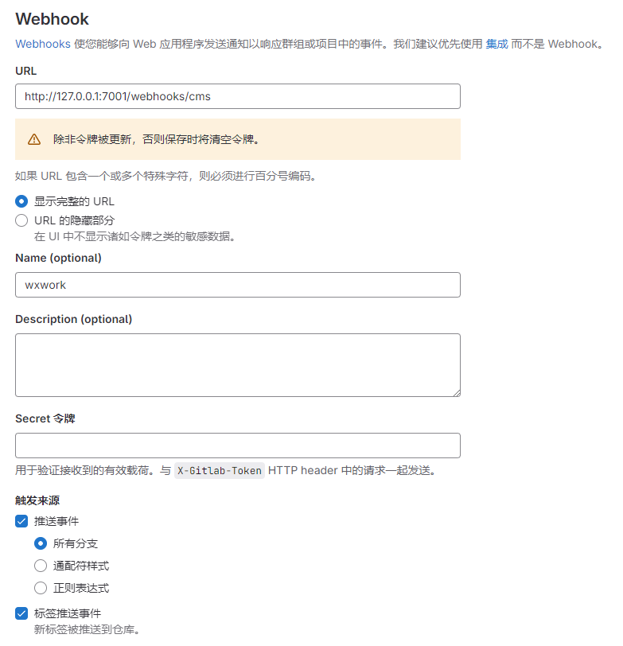

<p align="center">
  <h1>tushansusu</h1>
</p>


## 一、项目背景
1. 为什么创建这个项目

   在团队协作中使用企业微信和GitLab CE（以下简称GitLab）时，想在GitLabPull Request或CI后向企业微信相关项目的工作组推送通知。但遗憾的是，GitLab集成中并未提供企业微信的相关能力。（即使极狐文档中有企业微信集成的开关，但这个设置对我来说并未产生任何效果）

2. 为什么叫这个名字

   GitLab的LOGO是狐狸，当时我脑子里第一个出现的狐狸名字就是tushansusu（涂山苏苏）。

## 二、项目功能
1. 详细介绍程序的主要功能

   接收 GitLab Webhooks 消息并处理为企业微信Bot的数据格式，并通过HTTP的方式发送给企业微信Bot，实现将GitLab中发生的事件推送到企业微信。
2. 功能亮点和特色

## 三、使用方法
1. 开发环境要求

   | 环境    | 版本             | 说明 |
   | ------- |----------------| ---- |
   | OpenJDK | temurin-17.0.9 | -    |
   | Maven   | 3.9.6          | -    |
   | IDEA    | 2024.1         | -    |

   您并不需要与我的环境保持完全一致（如果一切顺利），我只是列出我的环境供您参考。

   如果您没有这么着急要修改项目并使用，您可以试着提一些Feature在Issue里，也许某一天这个功能就出现在了Releases列表了🫠。

3. 启动配置
   - 完整配置

     ```yaml
      server:
        port: 7001
      notice:
        wxwork:
          project-code: wxwork-bot-key
      logging:
        file:
          name: tushansusu.log
        level:
          com.github.tomseanmy.tushansusu: info
    
      spring:
        main:
          banner-mode: off
	  ```

   - server.port 启动端口

   - notice.wxwork 设置企业微信 Bot 相关参数，用项目code : 企业微信Botkey作为配置方式

     ```yaml
     #假设项目code为cms
     #企业微信bot连接为：https://qyapi.weixin.qq.com/cgi-bin/webhook/send?key=123456
     #配置应为
     notice:
       wxwork:
         cms: 123456
     ```

     也支持配置多个

     ```yaml
     notice:
       wxwork:
         cms: 123456
         oa: 123456
         mall: 123456
     ```

      - 在[GitLab Webhooks](https://docs.gitlab.com/ee/user/project/integrations/webhooks.html)中配置该程序的接口地址

        __路径：项目 > 设置 > Webhooks__

        > 格式：{host}:{port}/webhooks/项目code，项目code与notice.wxwork里面的项目code对应

        

4. 运行程序
   - 使用Java方式
     ```shell
      $ nohup java -Xms100m -Xmx100m -jar tushansusu.jar > tushansusu.log 2>&1  &
     ```

   - 使用Docker方式

     ```shell
     $ docker run -d -p 7001:7001 -v /data/application.yml:/data/application.yml --name tushansusu --restart=unless-stopped ghcr.io/tomseanmy/tushansusu
     ```

   - 使用Docker-Compose方式

     ```yaml
     version: "3"
      
     services:
       tushansusu:
         image: ghcr.io/tomseanmy/tushansusu:latest
         volumes:
           - /data/application.yml:/data/application.yml
         ports:
           - "7001:7001"
     ```

## 四、开发环境细节
- 主要的包和模块结构

  ```text
  - controller #接收来自外部的请求，比如GitLab的Webhooks回调
  - handle     #处理Webhooks消息
  - property   #参数配置
  - util       #工具
  - wxwork     #企业微信相关
  ```

- 关键代码文件的说明

  您如果看过源码应该已经发现了，接收来自GitLab Webhooks的入参并非封装的数据Schema，而是直接使用JSONObject的形式，这是因为在我写这个项目之前，我尝试了其他GitHub上的开源项目，发现了一个叫[gitlab4j-api](https://github.com/gitlab4j/gitlab4j-api)的项目，他封装了GitLab的相关操作，于是我将他用在了此项目中。但在实际与GitLab通信的过程中，我发现[GitLab Webhooks](https://docs.gitlab.com/ee/user/project/integrations/webhook_events.html)上的数据与这个项目的数据Schema并不一致，特别是pipeline事件中的jobs属性在最新的GitLab(16.10.8 CE)中已经变成了builds，我的需求仅仅需要支持解析GitLab Webhooks的数据并转化为企业微信的消息，不需要向GitLab发起任何API请求，又考虑到或许以后的某一天GitLab又换了新的数据结构我的项目将不再支持又需要大费周章的建立Schema并发布，所以选择了JSONObject。当然这并不是一个很好的方案，但对我目前的需求来说足够了。

## 七、未来规划
未来的版本会逐渐补齐GitLab Webhooks的各种事件（也可能不会）
